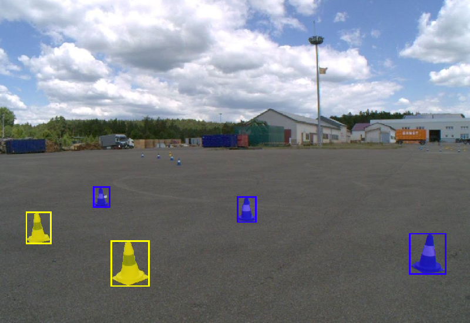

<!-- HTML used for easier automatic updates via scripts --><html><body>

  

<h1>The FSOCO Dataset</h1>

**+++ UPDATE: The FSOCO dataset is now publicly available without any contribution requirements. +++**

The FSOCO dataset helps Formula Student / FSAE teams to get started with their visual perception system for driverless disciplines.
State-of-the-art object detection systems require a substantial amount of data, which can be a challenge for new teams.
We aim to overcome this problem by providing data and to help experienced teams to even further boost their performance on the track with an increased set of ground truth data.

FSOCO contains bounding box and segmentation annotations from multiple teams and continues to grow thanks to numerous contributions from the Formula Student community.

The links to the dataset and more details can be found at:
 
<a href="https://fsoco.github.io/fsoco-dataset">fsoco.github.io/fsoco-dataset</a>

<h2>Formula Student Driverless</h2>

Formula Student / FSAE is an international design competition, where students design and build full-scale formula style racecars.
In 2017, Formula Student Germany introduced a new driverless class challenging the students to equip their cars with additional sensors and compute hardware to enable autonomous racing.
Henceforth, other events have adapted the driverless class and the self-driving racecars are quickly closing the gap to human drivers.

<h2>Development kit</h2>

For the devkit, please refer to:

<a href="https://github.com/fsoco/fsoco-devkit">github.com/fsoco/fsoco-devkit</a>

<h2>Citation</h2>

If you use the FSOCO dataset in your research, please cite our <a href="https://arxiv.org/abs/2012.07139">paper</a>:

<pre>
<code class="language bibtex" style="font-size: .75em">@article{fsoco_2022,
  title={FSOCO: The Formula Student Objects in Context Dataset},
  author={V{\"o}disch, Niclas and Dodel, David and Sch{\"o}tz, Michael},
  journal={SAE International Journal of Connected and Automated Vehicles},
  volume={5},
  number={12-05-01-0003},
  year={2022}
}</code>
</pre>
<h2>Contact</h2>

Please feel free to contact us with any questions, suggestions, or comments:

<ul>
<li>

Contact form: <a href="https://fsoco.github.io/fsoco-dataset/contact_us/">fsoco.github.io/fsoco-dataset/contact_us</a>

</li>
<li>

Email: <a href="mailto:fsoco.dataset@gmail.com">fsoco.dataset@gmail.com</a>

</li>
</ul>
</body></html>
