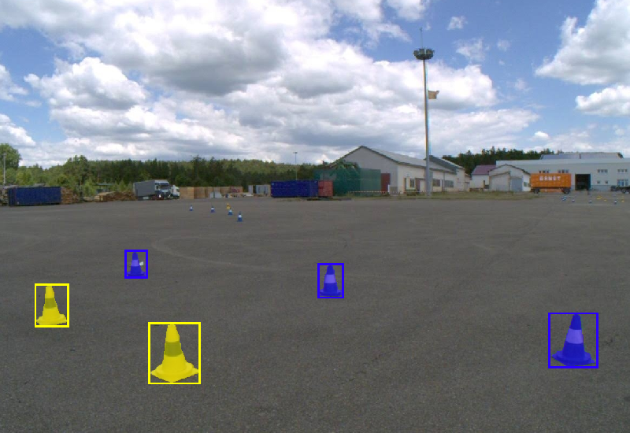

**+++ UPDATE: The FSOCO dataset is now publicly available without any contribution requirements. +++**

### The FSOCO Dataset

The FSOCO dataset helps Formula Student / FSAE teams to get started with their visual perception system for driverless disciplines.
State-of-the-art object detection systems require a substantial amount of data, which can be a challenge for new teams.
We aim to overcome this problem by providing data and to help experienced teams to even further boost their performance on the track with an increased set of ground truth data.

FSOCO contains bounding box and segmentation annotations from multiple teams and continues to grow thanks to numerous contributions from the Formula Student community.
Details on supported [object classes]({{ "/overview/" | relative_url }}) and [examples of our annotations]({{ "/examples/" | relative_url }}) can be found on this website.

### Formula Student Driverless

Formula Student / FSAE is an international design competition, where students design and build full-scale formula style racecars.
In 2017, Formula Student Germany introduced a new driverless class challenging the students to equip their cars with additional sensors and compute hardware to enable autonomous racing.
Henceforth, other events have adapted the driverless class and the self-driving racecars are quickly closing the gap to human drivers.  

### Citation
If you use the FSOCO dataset in your research, please cite our [paper](https://arxiv.org/abs/2012.07139):

<pre>
<code class="language bibtex" style="font-size: .75em">@article{fsoco_2022,
  title={FSOCO: The Formula Student Objects in Context Dataset},
  author={V{\"o}disch, Niclas and Dodel, David and Sch{\"o}tz, Michael},
  journal={SAE International Journal of Connected and Automated Vehicles},
  volume={5},
  number={12-05-01-0003},
  year={2022}
}</code>
</pre>

 
