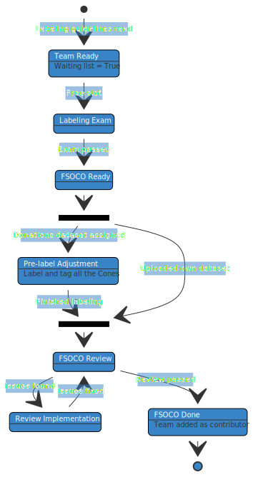

## How to contribute?
{:.no_toc}

*"Sharing is caring."*

> **Update**
>  
> As of August 2022, the FSOCO dataset is publicly available for all Formula Student / FSAE teams and everyone who is interested in cone detection.
> It is **not** necessary anymore to contribute before accessing the dataset.
> If you would still like to add your annotated images, please read the information on this website and then fill the contact form.

In order to continuously increase the size of the FSOCO dataset, we only grant access to our data once your team submitted their contribution.
Please note, that you will only get access to those types of annotations you included in your submission, e.g., teams submitting bounding box labels will only get access to our existing bounding boxes.
To access our segmentation data, a separate contribution is required.
A detailed step-by-step description of the process is given below the terms and conditions.

You just started with Formula Student Driverless and do not have your own images yet?
Don't worry, we've got you covered!
We will provide you with raw images that your team can label to get access to FSOCO.

If you have more high quality images than you can annotate within your team, consider to donate them to FSOCO.
We will assign those images to teams without raw data.

* TOC
{:toc}
---

### Terms and Conditions

#### Contribution policy

> Before you upload your data please make sure your team has full ownership of this data. In particular, all images need to be recorded on your own car or be taken by your team. Examples of violations of this policy are images from the FSG media server or screenshots of YouTube videos of other teams.
>
> By uploading your data, you confirm that it complies with the rules on this site and that you allow other FSOCO contributors to use your data for academic and competition-oriented work related to Formula Student Driverless.

#### Contribution requirements

We have defined a set of minimum requirements for submitting to FSOCO.
They are based on the experience with the first version of FSOCO.

* Depending on the desired annotation type, your contribution should contain at least ___ official cones *(approx. labeling effort of 15h for one person)*:
1. Bounding boxes: 2,500
 **OR** 
2. Segmentation: 1,500

* Furthermore, your contribution should:
1. Consist of approx. 50% images showing on-board data of rules-compliant tracks (acceleration, skidpad, autocross).
2. Not contain images, where one can identify people and license plates without their (owners) explicit permission.
3. Comply with the contribution policy above.

> **Note**
>  
> If you are interested in testing [panoptic segmentation](https://medium.com/@danielmechea/what-is-panoptic-segmentation-and-why-you-should-care-7f6c953d2a6a "Opens in a new tab."){:target="_blank"} for your autonomous pipeline but do not want to commit to a full scale submission yet, please contact us for other options.

> **Tips and Tricks**
>  
> We recommend to pre-label your images with your cone detector since then your goal becomes to beat the AI, increasing your awareness of mistakes made by the detector.
> Do not forget to add the object tags.
> If you do not have a cone detector yet, just start training as soon as you have a basic set and then continuously re-train it while extending your dataset.
>  
> For segmentation labels, Supervisely's smart labeling tool works very well for nearby cones.
> For cones that are farther away, it is typically faster to first draw the outline and then fill it.

### Step-by-step Manual

<!-- Comment via script because of unfortunate Mermaid syntax -->

[//]: # ()

#### Preparation

1. **Submit the form** on our [contact us]({{ "/contact_us/" | relative_url }}) page.
* Information on the similarity score can be found [here]({{ "/tools/#image-similarity-score" | relative_url }}).
* If applicable, please attach samples of your own images and existing labels. We will contact you for early feedback such that you do not have to wait until there is a free spot.
2. You will be added to our **waiting list**. To check your current position, please head over to the [login]({{ "/login/" | relative_url }}) page.

#### Label the data

1. Once your team is next in line, we will email you to start the contribution process.
2. If you have not done yet, please create 1 - 5 accounts on [Supervisely](https://supervise.ly/ "Opens in a new tab."){:target="_blank"} and send us the usernames by replying to our email. *Do not use GitHub to sign up.*
3. We will add the accounts to our FSOCO team and assign **labeling exams** to you to ensure that you **are familiar with our [labeling guidelines]({{ "/labels/#labeling_guidelines" | relative_url }})**. 

The following steps depend on whether your team already has raw images and existing labels.

**We have images and labels**
1. Please verify that your existing data **complies with our terms and conditions** above and our [labeling guidelines]({{ "/labels/#labeling_guidelines" | relative_url }}).
2. You can use one of our provided [label converters]({{ "/tools/#label-converters" | relative_url }}). If you need to write your own tool, please consider making a PR to our tools suite.
3. Add the [FSOCO Supervisely Import]({{ "/tools/#plugins" | relative_url }}) plugin to your Supervisely team. You will also need to add one of your team's computers as an agent. *Just follow the instructions on Supervisely.*
4. Upload your data to a private Supervisely team using our import plugin. Please **ensure the following style**:
* Clearly note the project of interest.
* The project should contain a single dataset named such everyone can clearly identify your team, e.g., the usual abbreviation, the team identifier at events, the name of your school, the city, ...
* The files in the dataset should be named like this *teamID_00001.png*. Use the same ID as in the name of the dataset and a 5 figures number. Combine both using an underscore.
5. Add our Supervisely account *fsocov2* as a developer to this team. We will copy your data then remove us from the team.
6. We will assign pseudo-labeling jobs to your Supervisely accounts to proceed with the next steps.

**We have unlabeled images**
1. Please verify that your images **comply with our terms and conditions** above.
2. Upload your images to a private Supervisely team.
3. Organize a labeling party in your team. A great chance for team bonding and to teach everyone how your magic perception system works under the hood.
4. Once you are done, follow the instructions above for "We have images and labels".

**We do not have images**
1. We will **assign labeling jobs with raw data** to your Supervisely accounts.

#### Pass the review

1. Once you are assigned labeling jobs on Supervisely, you will be able to **run our automated checks** on your contribution.
* Initiate the checks on the [login]({{ "/login/" | relative_url }}) page. *They are also run daily at 3 am CET / 6 pm PT.* 
* Query an overview of the number of issues and address the results in Supervisely.
2. **Submit a labeling job** for us to review it once the automated checks do not report any issue anymore.
3. We will review the job and, optionally, send it back to you for further enhancements.

#### Access the dataset

1. Once you passed the review, we will inform you.
2. We host our data on Google Drive. In order to share the FSOCO dataset with you, please provide us with an email address of a Google account. By sharing the data only with specific Google accounts, we can ensure the integrity of FSOCO and can easily update the dataset.
3. If you ever lose access to this Google account, please contact us so that we can update your credentials.
4. We will add your team's logo to our [contributors gallery]({{ "/contributors/" | relative_url }}).
5. Please note that a small portion of your data will not be added to the public dataset since we plan to publish a separate test set.
