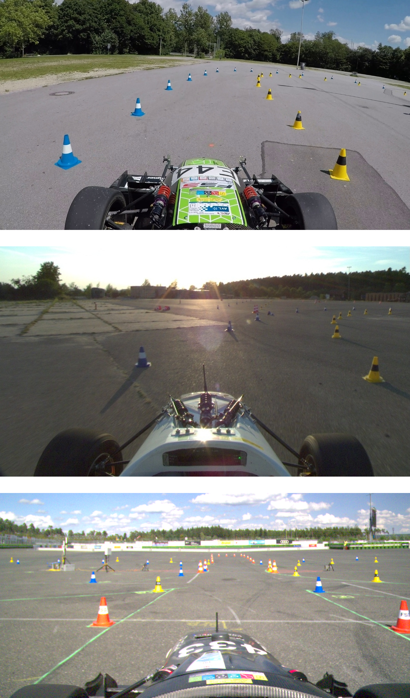

## Overview
{:.no_toc}

The FSOCO dataset consists of manually annotated images that have been submitted by the Formula Student Driverless community.
We provide ground truth data for cone detection and support both bounding boxes and instance segmentation.
On this page we give an overview of the dataset's features, its content, and our labeling policy.

* TOC
{:toc}
---

### Features

**Types of annotations**
- Bounding boxes
- Instance segmentation



Check out our [stats for nerds showcase]({{ "/stats_for_nerds" | relative_url }}) for more detailed statistics on the FSOCO dataset.

### Content

**Classes**
- Blue cone
- Yellow cone
- Small orange cone
- Large orange cone
- Other cone *(not compliant with [FSG rules](https://www.formulastudent.de/fsg/rules/ "Opens in a new tab."){:target="_blank"})*

**Tags**
- Cone is knocked over
- The cone's tape is modified (tape is removed or event sticker)
- The cone is truncated

### Labeling Policy

To ensure high quality of FSOCO, new contributions need to follow a set of guidelines.
They describe how to follow our conventions, e.g., they define which parts of a cone a bounding boxes should cover and how to use our classes and tags.
Check out our full [labeling guidelines]({{ "/labels/#labeling_guidelines" | relative_url }}).

### Differences to FSOCOv1

If your team already contributed to the previous version of FSOCO and now you are wondering why you should take the extra mile to contribute to this updated version, consider the following.
We have learned from the experience related to FSOCOv1 and identified a few problems, e.g., the quality of the labels differed a lot between some teams turning certain contributions into dead data.
To prevent such a situation in the future, we introduced more contribution rules and a stricter regulation.
 
In particular:
- a common labeling policy
- closer supervision of uploaded data
- usage of a single annotation format
- support for a common labeling tool
- multi-team management to get different input

While a few of the changes might seem to require a lot of effort for potential contributors, we are convinced that the community will win in the long run by having better ground truth data and, thus, higher quality autonomous races.

<iframe src="https://drive.google.com/file/d/1vx0mOkH3nlGVkiflHany2_GjiAX4yEWM/preview" frameborder="0" style="overflow:hidden" height="470" width="100%"></iframe>
